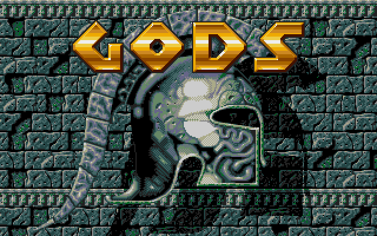

# A very early remake of Gods Amiga game from the Bitmap Brothers



Athenajs-gods is a simple remake of the [Gods](http://hol.abime.net/2754) game from the [Bitmap Brothers](https://en.wikipedia.org/wiki/The_Bitmap_Brothers).

The game was designed while developing the [AthenaJS](https://github.com/AthenaJS/athenajs) framework and only supports the begining of level one.

Although incomplete, this demo already makes use of and validates the following AthenaJS components:

 - maps with tiles & tile behaviors
 - map triggers based on player position & other conditions
 - enemy waves
 - tile-based collision detection
 - map vertical & horizontal scrolling
 - png-based sprites and bitmap fonts
 - sprites collision detection
 - special effects like SNES-like mosaic & sprite rotation
 - game scenes

## Demo

Head over to [https://athenajs.github.io/athenajs-gods/](https://athenajs.github.io/athenajs-gods/) for a demo.

## Installation

```
npm install && npm start
```

This will install dependencies, build gods and start a development server at `http:/127.0.0.1:8888`

## What's missing?

 - teleporters
 - enemy IA: enemies should be able to follow the user